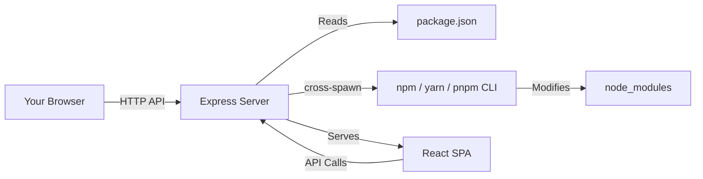
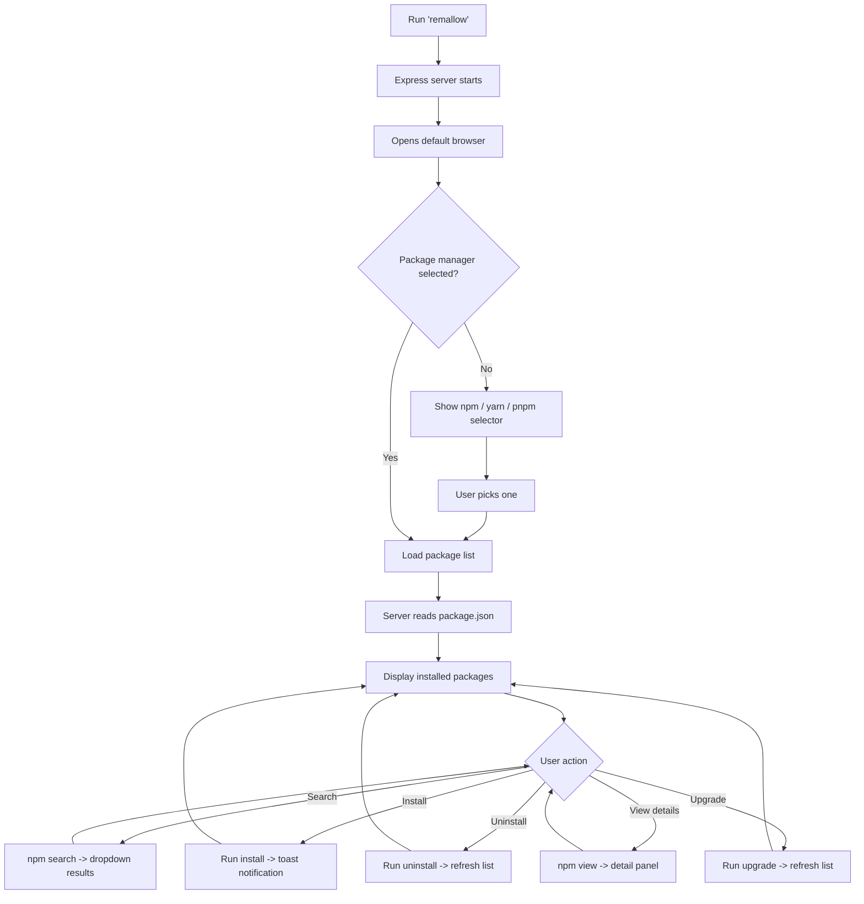

<div align="center">


<h2>Remallow</h2>
<p><strong>The visual package manager for Node.js projects</strong></p>

<p>Search, install, upgrade, and remove npm packages from your browser. No terminal commands needed.</p>


[](LICENSE)


[](CONTRIBUTING.md)
[](https://github.com/yokesharun/remallow)

</div>

---

## Why Remallow?

Managing packages through the terminal can be tedious. You have to remember commands, manually check for outdated packages, and switch between terminal windows just to install a dependency. Remallow gives you a clean, visual interface that runs locally in your browser -- no cloud, no account, no setup. Just run `remallow` in your project and start managing packages visually.

---

## Features

| Feature | Description |
|---------|-------------|
| **Cross-platform** | Works on Windows, macOS, and Linux |
| **npm + yarn + pnpm** | Supports all three major package managers |
| **Smart search** | Search npm registry with package details (description, version, publish date) |
| **Dark & light mode** | Toggle between themes with automatic persistence |
| **Package details** | View homepage, license, author, repository, and keywords for any package |
| **Filter & organize** | Filter by dependencies, devDependencies, or outdated packages |
| **Bulk update** | Update all outdated packages with one click |
| **Toast notifications** | Real-time success/error feedback with animated toasts |
| **Skeleton loading** | Smooth loading states instead of blank screens |
| **Secure** | Input validation, no shell injection, uses `cross-spawn` for safe command execution |
| **Offline UI** | All CSS and fonts bundled -- no CDN dependency |
| **Configurable** | Custom port via `--port` flag or `PORT` env variable |

---

## Quick Start

```bash
# Install globally
npm install -g remallow

# Navigate to any Node.js project
cd your-project

# Launch Remallow
remallow
```

That's it! Your default browser will open with the Remallow UI.

### Validate Installation

```bash
remallow --test
```

### Configuration

| Option | Example | Description |
|--------|---------|-------------|
| `--port` | `remallow --port 9000` | Custom server port (default: 8081) |
| `--test` | `remallow --test` | Validate installation |
| `PORT` env | `PORT=9000 remallow` | Set port via environment variable |

---

## Screenshots


---

## How It Works

Remallow is a lightweight local tool with two parts: an Express.js server that reads your project's `package.json` and executes package manager commands, and a React UI that renders in your browser.

**Everything runs locally.** No data is sent to external servers. No account needed.

### Architecture



### User Flow



---

## Comparison

| Feature | Terminal | Remallow | npm-gui |
|---------|---------|----------|---------|
| Visual interface | No | Yes | Yes |
| Search with details | Manual (`npm search`) | Built-in dropdown | No |
| Bulk update outdated | No | One click | No |
| Dark mode | N/A | Yes | No |
| pnpm support | Yes | Yes | No |
| Package details panel | `npm view` | Built-in | No |
| Toast notifications | N/A | Yes | No |
| Cross-platform | Yes | Yes | Partial |
| Offline (no CDN) | N/A | Yes | No |

---

## Roadmap

### Completed

- [x] npm support
- [x] yarn support
- [x] pnpm support
- [x] Search packages from npm registry
- [x] Install / uninstall / upgrade packages
- [x] View outdated packages
- [x] Cross-platform (Windows, macOS, Linux)
- [x] Dark / light mode
- [x] Package detail viewer
- [x] Toast notifications
- [x] Security hardening (input validation, no shell injection)
- [x] Bundled assets (no CDN dependency)
- [x] Filter by dependency type
- [x] Bulk update all outdated
- [x] Skeleton loading states
- [x] Version pinning (`package@version` syntax)

### In Progress

- [ ] Vulnerability scanning (`npm audit` integration)
- [ ] Script runner (run npm scripts from the UI)
- [ ] Lock file viewer (show resolved versions)
- [ ] Package size impact (bundlephobia API integration)
- [ ] Keyboard shortcuts (Ctrl+K to search, etc.)
- [ ] Auto-detect package manager from lock file

### Future

- [ ] Dependency graph visualization
- [ ] Auto-update checker with badge notifications
- [ ] Multi-project management
- [ ] Monorepo / workspace support
- [ ] Package.json diff view (before/after operations)
- [ ] Export / import dependency lists
- [ ] Plugin system for community extensions
- [ ] WebSocket-based real-time terminal output
- [ ] Package comparison view
- [ ] Favorites / bookmarks
- [ ] Install history log
- [ ] Peer dependency conflict resolver
- [ ] CI/CD integration (generate install commands)

---

## Contributing

We welcome contributions! Please see [CONTRIBUTING.md](CONTRIBUTING.md) for details.

---

## License

Released under [MIT](LICENSE) by [@yokesharun](https://github.com/yokesharun).

---

<div align="center">

**If you find Remallow useful, please give it a star!**

[](https://github.com/yokesharun/remallow)

<a href="https://www.buymeacoffee.com/yokesharun" target="_blank"></a>

</div>
